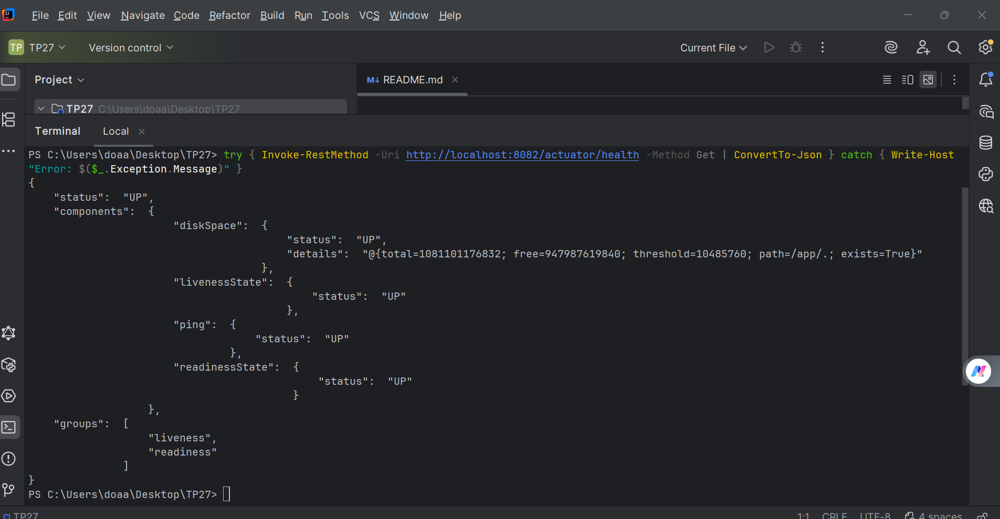
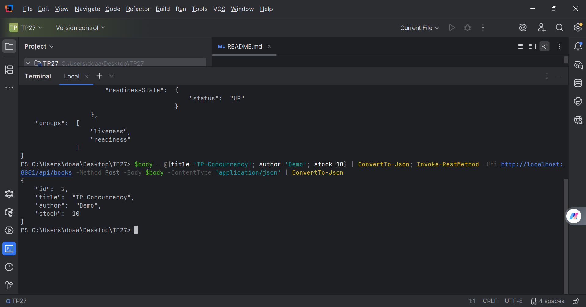

# TP27 - Scripts de Test de Charge

Ce répertoire contient les scripts de test de charge pour le TP27 sur la concurrence et la résilience.

## Scripts disponibles

### `loadtest.sh` (Bash - Linux/Mac/WSL)
Script Bash pour effectuer des tests de charge sur les instances book-service.

**Utilisation :**
```bash
chmod +x loadtest.sh
./loadtest.sh BOOK_ID 50
```

**Paramètres :**
- `BOOK_ID` : ID du livre à emprunter (par défaut: 1)
- `REQUESTS` : Nombre de requêtes à envoyer (par défaut: 50)

**Résultats :**
- Affiche le nombre de succès (200), conflits (409) et autres erreurs
- Génère des fichiers de détails dans un répertoire temporaire

### `loadtest.ps1` (PowerShell - Windows)
Script PowerShell pour effectuer des tests de charge sur Windows.

**Utilisation :**
```powershell
.\loadtest.ps1 -BookId BOOK_ID -Requests 50
```

**Paramètres :**
- `-BookId` : ID du livre à emprunter (par défaut: 1)
- `-Requests` : Nombre de requêtes à envoyer (par défaut: 50)

**Résultats :**
- Affiche le nombre de succès (200), conflits (409) et autres erreurs

## Configuration

Pour exposer les métriques Actuator (étape G1), ajouter dans `book-service/src/main/resources/application.yml` :

```yaml
management:
  endpoints:
    web:
      exposure:
        include: "health,info,metrics"
```

Voir `application.yml.example` pour un exemple complet.

## Notes

- Les tests répartissent les requêtes sur les ports 8081, 8083 et 8084
- Le script Bash nécessite `curl` et fonctionne mieux sous Linux/Mac/WSL
- Le script PowerShell nécessite PowerShell 5.1+ ou PowerShell Core




